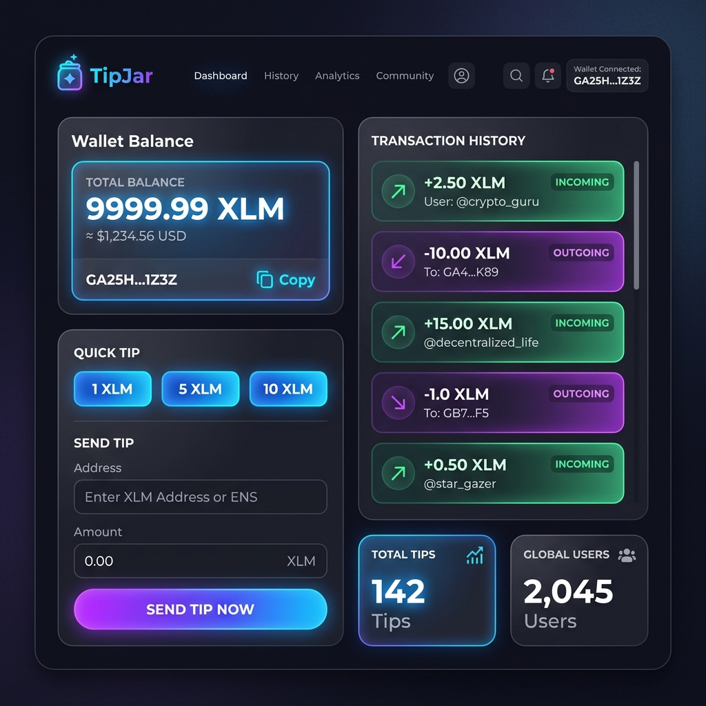

<div align="center">


<br /><br />

<h1>🪙 StarSend (StellarRiseIn)</h1>

<p><strong>A premium, gasless micro-tipping dApp built on the Stellar Testnet.</strong><br/>
Send XLM tips to any Stellar address or federation alias — instantly, with zero transaction fees for senders.</p>

<br />

[🚀 Live Demo](https://level4-pearl.vercel.app) &nbsp;•&nbsp; [📖 Docs](#architecture) &nbsp;•&nbsp; [🐛 Report Bug](https://github.com/Aniket24-create/StellarRiseIn_StarSend/issues) &nbsp;•&nbsp; [✨ Request Feature](https://github.com/Aniket24-create/StellarRiseIn_StarSend/issues)

</div>

---

## ✨ Features

| Feature | Description |
|---|---|
| 💸 **Gasless Tipping** | Transaction fees sponsored via Stellar Fee Bump — senders pay $0 |
| 🔑 **Freighter Wallet** | Seamless, non-custodial sign-in with the Freighter browser extension |
| 🌐 **Federation Support** | Resolve human-readable addresses like `alice*stellar.org` to public keys |
| 📊 **Real-time Dashboard** | Live XLM balance & streaming payment history via Horizon server-sent events |
| 📷 **QR Code Receive** | Generate a scannable QR for your Stellar address in one click |
| 🌗 **Dark / Light Mode** | System-aware theme toggle with smooth transitions |
| 📱 **Fully Responsive** | Optimized for mobile, tablet, and desktop viewports |
| 🎨 **Premium UI** | Glassmorphism design with neon accents, micro-animations, and Framer Motion |
| 💬 **Feedback System** | Built-in feedback modal for community insights |
| ✅ **Test Coverage** | Unit tests via Vitest + React Testing Library |

---

## 🖼️ Screenshots

<div align="center">
  
  <br />
  
  <br />
  <em>The premium glassmorphism dashboard featuring real-time XLM balance and streaming transaction history.</em>
  <br /><br />
  <a href="https://level4-pearl.vercel.app">🚀 Explore the Live Demo</a>
</div>

---

## 🏗️ Architecture

```
src/
├── components/
│   ├── LandingPage.tsx      # Hero / wallet connect screen
│   ├── Dashboard.tsx        # Balance card + account overview
│   ├── TipForm.tsx          # Send XLM form with federation resolution
│   ├── HistoryList.tsx      # Real-time streaming transaction history
│   ├── TransactionModal.tsx # Processing / success / error overlay
│   ├── ReceiveModal.tsx     # QR code receive modal
│   └── FeedbackModal.tsx    # Community feedback collector
├── utils/
│   ├── stellar.ts           # Horizon SDK: balance, payments, Fee Bump
│   ├── freighter.ts         # Freighter API: connect, sign, address helpers
│   └── federation.ts        # Stellar federation address resolver
├── App.tsx                  # Root: state, routing, wallet orchestration
├── main.tsx                 # React 19 entry point
└── index.css                # Global styles + Tailwind config
```

### Key Technical Decisions

- **Fee Bump Transactions** — The `applyFeeBumpAndSubmit` utility wraps every inner transaction in a fee-bump envelope signed by a sponsor key, making tips genuinely gasless for end users. In production, this signing step should be delegated to a secure backend.
- **Horizon Streaming** — `streamPayments()` opens a persistent SSE connection to Horizon so balances and history update in real-time without polling.
- **Federation Resolution** — `federation.ts` resolves `name*domain` aliases through Stellar's federation protocol before building a payment transaction.
- **Freighter v6 Compatibility** — The freighter utilities normalize both the legacy boolean and the new `{ isConnected }` object response shapes from the `@stellar/freighter-api` SDK.

---

## 🚀 Getting Started

### Prerequisites

| Requirement | Version |
|---|---|
| Node.js | ≥ 18 |
| npm | ≥ 9 |
| [Freighter Wallet](https://www.freighter.app/) | Latest (browser extension) |

> **Important:** Switch Freighter to **Testnet** mode before connecting.

### 1. Clone the repository

```bash
git clone https://github.com/Aniket24-create/StellarRiseIn_StarSend.git
cd StellarRiseIn_StarSend
```

### 2. Install dependencies

```bash
npm install
```

### 3. Configure environment variables

Create a `.env` file at the project root:

```env
# Optional — enables gasless sponsorship of transaction fees.
# WARNING: Never expose a funded secret key in a frontend build for production use.
# Move this to a secure backend before going live.
VITE_SPONSOR_SECRET_KEY=S...your_testnet_sponsor_secret...
```

> If `VITE_SPONSOR_SECRET_KEY` is omitted, transactions are submitted directly (users pay the standard Stellar base fee).

### 4. Start the development server

```bash
npm run dev
```

Open [http://localhost:5173](http://localhost:5173) and connect Freighter on Testnet.

---

## 🧑‍💻 Available Scripts

| Command | Description |
|---|---|
| `npm run dev` | Start Vite dev server with HMR |
| `npm run build` | Type-check + production bundle |
| `npm run preview` | Preview the production build locally |
| `npm run lint` | Run ESLint across the project |
| `npx vitest` | Run unit tests |

---

## 🧪 Testing

Tests are co-located in `src/` and use **Vitest** + **React Testing Library** + **jsdom**.

```bash
# Run all tests once
npx vitest run

# Watch mode
npx vitest
```

---

## 🔗 Tech Stack

| Layer | Technology |
|---|---|
| **Framework** | React 19 + TypeScript 6 |
| **Build Tool** | Vite 8 + vite-plugin-node-polyfills |
| **Styling** | Tailwind CSS 3 + custom glassmorphism tokens |
| **Animation** | Framer Motion 12 |
| **Blockchain** | Stellar Testnet (Horizon API) |
| **Wallet** | Freighter (`@stellar/freighter-api` v6) |
| **Stellar SDK** | `@stellar/stellar-sdk` v15 |
| **QR Code** | `react-qr-code` |
| **Icons** | Lucide React |
| **Testing** | Vitest + React Testing Library + jsdom |
| **Linting** | ESLint 10 + typescript-eslint |

---

## 🗺️ Roadmap

- [x] **Soroban Smart Contract** - Rust-based contract for tip escrow and batch operations
- [ ] Secure backend relayer for Fee Bump signing
- [ ] Multi-asset tip support (USDC, custom tokens)
- [ ] Smart contract integration for conditional tips
- [ ] Tip leaderboard & social profiles
- [ ] Mobile app (React Native)
- [ ] Mainnet deployment

## 🦀 Smart Contract

The project includes a Soroban smart contract written in Rust. You can find the full source code in [contracts/src/lib.rs](./contracts/src/lib.rs).

The contract provides:

- **Tip Escrow**: Secure tip storage until claimed
- **Batch Operations**: Claim multiple tips in one transaction
- **Message Support**: Attach messages to tips
- **Statistics Tracking**: Global tip metrics
- **Admin Controls**: Emergency functions

### Contract Features

```rust
// Send a tip with message
send_tip(from, to, token_address, amount, message) -> tip_id

// Claim individual tip
claim_tip(tip_id, token_address)

// Batch claim multiple tips
batch_claim_tips(tip_ids, token_address)

// Query functions
get_tip(tip_id) -> Tip
get_user_tips(user) -> Vec<tip_id>
get_stats() -> TipStats
```

### Quick Deploy

```bash
cd contracts
# Windows
.\deploy.ps1

# Linux/macOS  
./deploy.sh
```

See [SETUP.md](./SETUP.md) for detailed deployment instructions.

---

## 🤝 Contributing

Contributions, issues, and feature requests are welcome!

1. Fork the repository
2. Create a feature branch: `git checkout -b feature/amazing-feature`
3. Commit your changes: `git commit -m 'feat: add amazing feature'`
4. Push to the branch: `git push origin feature/amazing-feature`
5. Open a Pull Request

---

## ⚠️ Security Notice

This project is a **Testnet demo**. The `VITE_SPONSOR_SECRET_KEY` is exposed to the browser bundle for demonstration purposes only. **Never use a funded Mainnet key** in a client-side environment. In production, move all secret key operations to a secure, server-side relayer.

---
Vercel Deployment Link :-https://level4-pearl.vercel.app/

## 📄 License

Distributed under the MIT License. See `LICENSE` for more information.

---

<div align="center">

Built with ❤️ on the Stellar Network &nbsp;•&nbsp; [Stellar Developer Docs](https://developers.stellar.org) &nbsp;•&nbsp; [Freighter Docs](https://docs.freighter.app)

</div>
